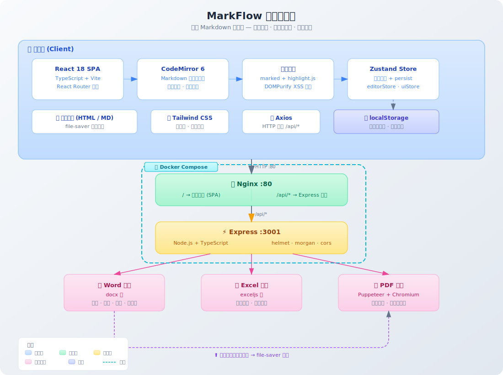

# MarkFlow

> 一个功能强大的在线 Markdown 编辑器，支持实时预览并导出为 Word / Excel / PDF 等格式。

---

## 系统架构

<p align="center">
  
</p>

---

## 界面设计

### 主编辑器界面（分屏模式）

```
┌──────────────────────────────────────────────────────────┐
│  🔷 MarkFlow    [我的文档 ▼]              [🌙] [⬇ 导出]  │
├──────────────────────────────────────────────────────────┤
│  [B] [I] [<>] [🔗] [🖼] [≡] [T] │ [编辑|分屏|预览] │ 128字│
├─────────────────────────┬────────────────────────────────┤
│                         │                                │
│  # 我的文档              │  我的文档                       │
│                         │  ═══════════                   │
│  这是一段**粗体**文字     │  这是一段 粗体 文字              │
│                         │                                │
│  ## 表格示例             │  表格示例                       │
│                         │  ──────────                    │
│  | 姓名 | 年龄 |         │  ┌──────┬──────┐              │
│  | --- | --- |          │  │ 姓名  │ 年龄  │              │
│  | 张三 | 25  |          │  ├──────┼──────┤              │
│  | 李四 | 30  |          │  │ 张三  │  25  │              │
│                         │  │ 李四  │  30  │              │
│  ```js                  │  └──────┴──────┘              │
│  console.log("hello")   │                                │
│  ```                    │  console.log("hello")          │
│                         │                                │
│          📝 编辑器        │ ⟵  拖拽  ⟶│    👁 预览面板     │
└─────────────────────────┴────────────────────────────────┘
```

### 界面区域说明

| 区域 | 说明 |
|------|------|
| **顶部导航栏** | Logo、文档选择下拉、主题切换按钮、导出按钮 |
| **编辑器工具栏** | 左侧 Markdown 快捷操作（粗体/斜体/代码/链接/图片/列表/表格），中间视图切换（编辑/分屏/预览），右侧字数统计 |
| **编辑器面板** | CodeMirror 6 内核，支持语法高亮、行号显示、代码折叠、自动换行 |
| **预览面板** | 实时渲染 Markdown 为 HTML，支持 GFM 表格、代码高亮、任务列表 |
| **拖拽分隔条** | 可拖拽调节编辑器与预览面板的比例（20% ~ 80%） |

### 视图模式

| 模式 | 说明 |
|------|------|
| 仅编辑 | 全屏显示编辑器，适合专注写作 |
| 分屏 | 左编辑右预览，实时对照，支持拖拽调节比例 |
| 仅预览 | 全屏显示渲染结果，适合阅读和检查 |

### 导出对话框

```
┌─────────────────────────────────────┐
│  导出文档                        ✕  │
├─────────────────────────────────────┤
│                                     │
│  文件名                             │
│  ┌─────────────────────────────┐    │
│  │ my-document                 │    │
│  └─────────────────────────────┘    │
│                                     │
│  导出格式                           │
│  ┌─────────────────────────────┐    │
│  │ 📄 Word (.docx)             │    │
│  │ 导出为 Word 文档，保留格式   │    │
│  └─────────────────────────────┘    │
│  ┌─────────────────────────────┐    │
│  │ 📊 Excel (.xlsx)            │    │
│  │ 将表格数据导出为 Excel      │    │
│  └─────────────────────────────┘    │
│  ┌─────────────────────────────┐    │
│  │ 📑 PDF (.pdf)               │    │
│  │ 导出为 PDF，适合打印和分享   │    │
│  └─────────────────────────────┘    │
│  ┌─────────────────────────────┐    │
│  │ 🌐 HTML (.html)             │    │
│  │ 导出为完整 HTML 页面         │    │
│  └─────────────────────────────┘    │
│  ┌─────────────────────────────┐    │
│  │ 📝 Markdown (.md)           │    │
│  │ 保存原始 Markdown 文件       │    │
│  └─────────────────────────────┘    │
│                                     │
│              [取消]   [⬇ 导出]      │
└─────────────────────────────────────┘
```

---

## 技术栈

### 前端

| 技术 | 用途 |
|------|------|
| **React 18** | UI 框架 |
| **TypeScript** | 类型安全 |
| **Vite** | 构建工具 |
| **CodeMirror 6** | 代码编辑器内核 |
| **marked** | Markdown 解析 |
| **highlight.js** | 代码高亮 |
| **Zustand** | 状态管理 |
| **Tailwind CSS** | 样式框架 |
| **React Router** | 路由 |
| **Axios** | HTTP 请求 |
| **DOMPurify** | XSS 安全过滤 |
| **file-saver** | 前端文件下载 |

### 后端

| 技术 | 用途 |
|------|------|
| **Node.js + Express** | 后端框架 |
| **TypeScript** | 类型安全 |
| **docx** | 生成 Word 文档 |
| **exceljs** | 生成 Excel 文档 |
| **Puppeteer + Chromium** | 生成 PDF |
| **helmet** | 安全 HTTP 头 |
| **morgan** | 请求日志 |

### 部署

| 技术 | 用途 |
|------|------|
| **Docker** | 容器化 |
| **docker-compose** | 服务编排 |
| **Nginx** | 静态文件托管 + 反向代理 |

---

## 功能清单

| 功能 | 状态 | 说明 |
|------|:----:|------|
| Markdown 实时编辑 | ✅ | CodeMirror 6 内核 |
| 实时预览 | ✅ | 分屏 / 纯编辑 / 纯预览 |
| GFM 支持 | ✅ | 表格、任务列表、删除线等 |
| 代码高亮 | ✅ | highlight.js 支持 180+ 语言 |
| 导出 Word (.docx) | ✅ | 保留标题/表格/列表/代码块样式 |
| 导出 Excel (.xlsx) | ✅ | 自动提取表格，支持样式美化 |
| 导出 PDF | ✅ | Puppeteer 渲染，支持页眉页脚 |
| 导出 HTML | ✅ | 完整独立 HTML 文件 |
| 保存 .md 文件 | ✅ | 前端直接下载 |
| 暗黑模式 | ✅ | 一键切换 |
| 自动保存 | ✅ | LocalStorage 持久化 |
| 快捷键 | ✅ | Ctrl+S / Ctrl+B / Ctrl+I 等 |
| 文档管理 | ✅ | 创建/切换/删除多个文档 |
| 工具栏快捷插入 | ✅ | 标题/粗体/链接/表格一键插入 |
| 拖拽分屏 | ✅ | 可调节编辑/预览面板比例 |

---

## 项目结构

```
markflow/
├── src/                          # 前端 (React + TypeScript)
│   ├── main.tsx                  # 入口文件
│   ├── App.tsx                   # 根组件 + 路由
│   ├── components/
│   │   ├── Editor/
│   │   │   ├── MarkdownEditor.tsx    # 核心编辑器（CodeMirror 6）
│   │   │   ├── EditorToolbar.tsx     # 编辑器工具栏
│   │   │   ├── PreviewPanel.tsx      # 预览面板
│   │   │   └── SplitView.tsx         # 分屏视图
│   │   ├── Export/
│   │   │   ├── ExportDialog.tsx      # 导出对话框
│   │   │   └── ExportButton.tsx      # 导出按钮
│   │   ├── Layout/
│   │   │   ├── Header.tsx            # 顶部导航栏
│   │   │   └── Layout.tsx            # 页面布局
│   │   └── Common/
│   │       └── Modal.tsx             # 通用弹窗
│   ├── pages/
│   │   ├── Home.tsx                  # 首页
│   │   ├── EditorPage.tsx            # 编辑器页面
│   │   └── NotFound.tsx              # 404 页面
│   ├── hooks/
│   │   ├── useTheme.ts              # 主题切换
│   │   ├── useAutoSave.ts           # 自动保存
│   │   ├── useExport.ts             # 导出逻辑
│   │   └── useKeyboardShortcuts.ts  # 快捷键
│   ├── stores/
│   │   ├── editorStore.ts           # 编辑器状态（Zustand + persist）
│   │   └── uiStore.ts               # UI 状态
│   ├── services/
│   │   ├── api.ts                   # Axios 实例
│   │   └── export.api.ts            # 导出 API
│   └── styles/
│       ├── globals.css              # 全局样式 + Tailwind
│       ├── editor.css               # 编辑器样式
│       └── markdown-preview.css     # 预览面板样式
│
├── server/                       # 后端 (Node.js + Express)
│   ├── package.json
│   ├── tsconfig.json
│   └── src/
│       ├── index.ts                 # 服务入口
│       ├── routes/
│       │   └── export.routes.ts     # 导出路由
│       ├── controllers/
│       │   └── export.controller.ts # 导出控制器
│       ├── services/
│       │   ├── word.service.ts      # Word 导出（docx）
│       │   ├── excel.service.ts     # Excel 导出（exceljs）
│       │   └── pdf.service.ts       # PDF 导出（Puppeteer）
│       └── middlewares/
│           └── error.middleware.ts   # 错误处理
│
├── Dockerfile.frontend           # 前端镜像（多阶段构建 → Nginx）
├── Dockerfile.server             # 后端镜像（Node.js + Chromium）
├── docker-compose.yml            # 容器编排
├── nginx.conf                    # Nginx 配置
├── package.json                  # 前端依赖
├── vite.config.ts                # Vite 配置
├── tailwind.config.js            # Tailwind 配置
└── tsconfig.json                 # TypeScript 配置
```

---

## 快速开始

### 本地开发

```bash
# 克隆项目
git clone https://github.com/your-name/markflow.git
cd markflow

# 安装前端依赖
npm install

# 安装后端依赖
cd server && npm install && cd ..

# 同时启动前后端
npm run dev:all
```

前端访问 `http://localhost:5173`，后端运行在 `http://localhost:3001`。

> HTML 和 Markdown 导出在前端完成，无需启动后端。Word / Excel / PDF 导出需要后端服务。

### Docker 部署

```bash
docker compose up --build
```

访问 `http://localhost` 即可使用。

---

## 可用脚本

| 命令 | 说明 |
|------|------|
| `npm run dev` | 启动前端开发服务器 |
| `npm run build` | 构建前端生产包 |
| `npm run server` | 启动后端服务 |
| `npm run dev:all` | 同时启动前后端 |
| `npm run preview` | 预览生产构建 |

---

## 更新日志

### V1.0.2 (2026-02-26)

#### 安全
- 将 `.env` 从 git 追踪中移除，防止敏感配置泄露
- 新增 `.env.example` 环境变量模板供开发者参考

#### 改进
- 完善 `.gitignore`：新增 `.env`、`.env.*.local`、`.vscode/`、`.idea/`、`*.tsbuildinfo`、`coverage/` 等忽略规则

### V1.0.1 (2026-02-25)

#### 修复
- 修复 Excel 导出时工作表名称包含 Markdown 标记（`**`）及非法字符（`* ? : \ / [ ]`）导致导出失败的问题
- 修复 Excel 导出时单元格内容保留 Markdown 标记（粗体、斜体、删除线、链接、代码等）的问题，现导出为纯文本
- 修复 `marked` Renderer `code` 方法类型签名不兼容导致 TypeScript 编译失败的问题
- 修复 Docker 构建时 Puppeteer 自动下载 Chromium 因网络不通导致失败的问题（改用系统 Chromium）
- 修复 `.dockerignore` 包含中文字符导致 BuildKit 报错的问题

#### 改进
- 编辑器工具栏新增返回首页按钮
- 网站图标从 favicon.ico 更新为 SVG 格式
- deploy.sh 脚本全面重构：新增 Banner、update / health / exec 命令、服务参数化、深度清理、资源状态监控
- deploy.sh 兼容 Docker Compose V1 和 V2
- docker-compose.yml 新增 `container_name` 和 `image` 命名
- 新增系统架构 SVG 图，README 中引用替代 ASCII 架构图

### V1.0.0 (2026-02-25)

**首个正式版本发布**

#### 核心编辑
- 基于 CodeMirror 6 的 Markdown 实时编辑器，支持语法高亮、行号、代码折叠
- 实时预览（marked + highlight.js + DOMPurify XSS 过滤）
- GFM 支持（表格、任务列表、删除线、围栏代码块）
- 三种视图模式：仅编辑 / 分屏 / 仅预览
- 可拖拽分屏比例（20% ~ 80%）

#### 工具栏与快捷键
- 工具栏一键插入：粗体、斜体、代码、链接、图片、列表、表格
- 快捷键支持：Ctrl/Cmd+S 保存、Ctrl/Cmd+B 粗体、Ctrl/Cmd+I 斜体等
- 实时字数统计

#### 文档管理
- 多文档创建、切换、删除
- Zustand + localStorage 自动保存与持久化

#### 多格式导出
- Word (.docx) — 保留标题、表格、列表、代码块样式
- Excel (.xlsx) — 自动提取表格，清除 Markdown 标记，样式美化，冻结首行 + 自动筛选
- PDF (.pdf) — Puppeteer 高保真渲染，支持页眉页脚
- HTML (.html) — 完整独立页面，前端直接下载
- Markdown (.md) — 保存源文件，前端直接下载

#### 主题
- 明暗主题一键切换，编辑器与预览面板同步

#### 部署
- Docker 容器化（前端 Nginx + 后端 Node.js + Chromium）
- docker-compose 一键编排，兼容 V1/V2
- deploy.sh 脚本：start / stop / restart / build / update / logs / status / health / clean / exec
- 后端健康检查端点 `/api/health`

---

## License

MIT
